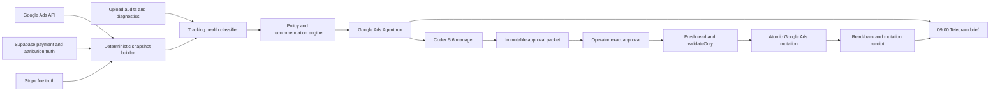

# Google Ads Agent Implementation Plan

> **For agentic workers:** REQUIRED SUB-SKILL: Use `superpowers:subagent-driven-development` (recommended) or `superpowers:executing-plans` to implement this plan task-by-task. Steps use checkbox (`- [ ]`) syntax for tracking.
>
> **Authority:** Reference only. `docs/ROADMAP.md` remains the sole active priority queue; this plan elaborates rank 4 and does not authorise implementation or any live Google Ads mutation by itself.

**Goal:** Build a production-grade, approval-gated Google Ads manager that sends a PHI-free essential brief to Telegram at 09:00 Australia/Sydney, proposes revenue-led changes, and can validate, apply, verify, and roll back only the exact mutations the operator approves.

**Architecture:** A deterministic Vercel control plane owns time windows, Google Ads/Supabase/Stripe reconciliation, tracking health, policy gates, persistent run state, Telegram delivery, and mutation receipts. Codex 5.6 Sol Max owns interpretation and proposal review; it never performs arithmetic from prose and never mutates the account without a fresh, exact operator approval in the Codex task. Google Ads remains the serving system, Supabase/Stripe remain the financial truth, and PostHog remains a secondary funnel diagnostic.

**Tech Stack:** Next.js 15.5 App Router on Node 24, TypeScript 5.9, Supabase PostgreSQL, Stripe v22, Google Ads API v24, Vercel Cron, Telegram Bot API, Vitest, Codex 5.6 Sol Max.

## Global Constraints

- This plan elaborates `docs/ROADMAP.md` rank 4, “Prove paid contribution by service.” It does not reorder the roadmap.
- Every Ads mutation requires a fresh operator approval for a named proposal. A general “manage Ads” instruction is not mutation approval.
- Telegram is report and critical-alert delivery only in v1. Mutation approvals stay in the Codex task; there are no Telegram approval buttons.
- The agent is read-only by default. `validateOnly` is mandatory before every apply call.
- No autonomous emergency pause, budget change, keyword change, creative change, asset change, schedule change, targeting change, or campaign creation.
- Medicine-name and active-ingredient keywords are OFF by operator policy. Service and condition vocabulary such as “prescription,” “repeat script,” “ED assessment,” and “hair loss assessment” remains allowed.
- No Customer Match, health-page remarketing, lookalikes, custom health audiences, Display, Performance Max, Maximize Clicks, or broad-match positives during controlled demand validation.
- One Search campaign owns each launched service: medical certificates, repeat prescriptions, ED, hair loss, and women’s health. Weight loss and general consult remain excluded.
- Daily budget envelope starts at A$84: Med Certs A$20, Scripts A$40, ED A$7, Hair Loss A$7, Women’s Health A$10.
- Daily reporting uses the previous closed Australia/Sydney calendar day plus a rolling 30-day window ending on that same day. It does not mix a partial current day with closed-day economics.
- First-order contribution is Net Retained Purchase Value minus actual Stripe/payment fees minus attributable Ads spend. It is not full accounting profit.
- Owner-doctor labour has zero marginal cash cost below capacity, but queue, safety, fulfilment, refund, support, and capacity gates can still block scaling.
- The server purchase import remains the sole Primary purchase action. Refunds and disputes continue to adjust Net Retained Purchase Value. Browser and funnel conversions remain Secondary/non-bidding.
- Tracking state must be `GREEN` before the agent may recommend scaling. `AMBER` or `RED` produces `HOLD` or investigation only.
- All Telegram payloads, proposal metadata, run snapshots, and audit receipts are aggregate and PHI-free.
- Do not upgrade Next, React, Tailwind, Framer Motion, Node, pnpm, or another pinned dependency as part of this work.
- Keep commits small and task-scoped. Do not combine a reporting change with a live Ads mutation.

---

## 1. Settled Operating Model

### Canonical language

**Google Ads Agent:** The combined deterministic control plane and Codex manager. It is not an LLM with unrestricted account credentials.

**Daily Ads Brief:** The six-to-eight-line aggregate Telegram message delivered at 09:00 Sydney. It reports only tracking state, service economics, breached guardrails, and the next decision.

**Approval Packet:** One immutable proposal containing the exact Google Ads resource names, expected current values, requested new values, rationale, risk, expiry, validation result, and rollback recipe.

**Mutation Receipt:** The append-only record of baseline read, `validateOnly` result, apply result, read-back verification, actor, timestamps, and rollback state.

**Tracking State:** `GREEN`, `AMBER`, or `RED`, computed from deterministic evidence. It is not an LLM opinion.

### Human-in-the-loop contract

1. The 09:00 control plane computes and stores a trusted snapshot.
2. Telegram receives the essential brief whether the recommendation is `HOLD`, `INVESTIGATE`, or `APPROVAL_NEEDED`.
3. Codex reads the stored snapshot and live account state, explains the evidence, and prepares at most one material change packet at a time.
4. The operator approves by replying with the exact proposal key, for example `APPROVE ADS-20260730-01`.
5. Codex re-reads live state. Any baseline drift aborts the proposal.
6. The mutation gateway runs `validateOnly`, applies the same operations, reads the resources back, and records the receipt.
7. Telegram receives a short mutation result only after verified apply or verified abort.

No approval can be inferred from silence, a previous proposal, a plan approval, a Telegram reaction, or a broad instruction to improve performance.

---

## 2. Dated Baseline and Campaign Constitution

The performance figures below are a read-only snapshot for 2026-06-28 through 2026-07-27. Every future decision must re-derive them from live sources.

| Campaign | Spend | Attributed orders | Net retained revenue | Stripe fees | First-order contribution | Current conclusion |
|---|---:|---:|---:|---:|---:|---|
| Scripts | A$343.64 | 21 | A$559.00 | A$27.01 | **+A$188.35** | Only proven positive contributor; refund gate blocks immediate scale |
| Med Certs | A$403.63 | 14 | A$404.25 | A$11.12 | **−A$10.50** | Near break-even; hold and improve relevance |
| Hair Loss | A$154.72 | 1 | A$49.95 | A$1.14 | **−A$105.91** | Automated bidding has insufficient data |
| ED | A$31.08 | 0 | A$0 | A$0 | **−A$31.08** | Unproven; A$31 click is outside a controlled pilot |
| Enabled set | A$933.07 | 36 | A$1,013.20 | A$39.27 | **+A$40.86** | Slightly positive only because Scripts subsidises losses |
| Specialist, paused | A$234.85 | 0 | A$0 | A$0 | **−A$234.85** | Retire permanently |

All three Scripts refunds in the baseline were controlled-substance declines before the 2026-07-26 negative-list change. The post-change cohort had only two orders at the audit, so the cause is addressed but the fix is not yet statistically proven.

### Target campaign constitution

| Service | Campaign decision | Initial bidding | Daily budget | Structure |
|---|---|---|---:|---|
| Medical certificates | Reuse `JDM \| Search \| Med Certs` | Hold tCPA A$22 during observation | A$20 | Same-day/general, work, carer, student intent groups |
| Repeat prescriptions | Reuse `JDM \| Search \| Scripts` | Maximize conversion value, no tROAS until gate passes | A$40 | Repeat core, renewal, eScript intent groups |
| ED | Reuse `IM \| Search \| ED \| Pilot` | Manual CPC, initial ceiling A$3 | A$7 | Assessment and condition-intent groups |
| Hair loss | Reuse `IM \| Search \| Hair Loss \| Pilot` | Manual CPC, initial ceiling A$3 | A$7 | Assessment and treatment-intent groups |
| Women’s health | Create new, paused until approved | Manual CPC, initial ceiling A$3 | A$10 | Separate UTI and contraception-review groups |
| Specialist | Keep paused and mark retired | None | A$0 | Never reuse as a traffic campaign |
| Display | Keep paused and retire | None | A$0 | Remove custom audiences before any accidental re-enable |

Reuse campaign IDs to preserve history, then standardise active names through an approved hygiene packet: `IM | Search | Med Certs`, `IM | Search | Scripts`, `IM | Search | ED | Pilot`, `IM | Search | Hair Loss | Pilot`, and `IM | Search | Women’s Health | Pilot`. Prefix retired campaigns with `ARCHIVE |` rather than deleting them. Ad groups use `AG | <intent>`; experiment labels use the immutable `EXP-YYYYMMDD-NN` key.

### Scaling and pilot gates

**Scripts:** On or after 2026-08-09, require at least 10 mature post-2026-07-26 orders, refund rate below 10%, zero controlled-substance refunds, at least 20% fee-aware contribution margin, stable operations, and `GREEN` tracking. Then propose tROAS 135% at the same A$40 budget. Observe at least seven days before a maximum 20% budget step.

**ED, Hair Loss, Women’s Health:** Each service receives a maximum A$150 negative first-order contribution or 30 days, whichever arrives first. Ten clicks without checkout progression triggers investigation; 30 clicks without a retained order triggers a pause proposal. The agent never pauses automatically.

**Med Certs:** Keep A$20 and tCPA A$22 while the recent strategy change matures. Prioritise ad relevance and landing-page alignment. Do not raise budget while fee-aware contribution is negative.

---

## 3. Target System



### File map

| File | Responsibility |
|---|---|
| `lib/google-ads/client.ts` | Shared Google Ads OAuth, search, and generic mutate client; preserves existing conversion API behaviour |
| `lib/ads-agent/types.ts` | Stable snapshot, tracking, recommendation, proposal, experiment, and receipt types |
| `lib/ads-agent/time.ts` | Australia/Sydney closed-day and rolling-window boundaries across AEST/AEDT |
| `lib/ads-agent/stripe-fees.ts` | Actual Stripe fee lookup and durable fee cache |
| `lib/ads-agent/account-state.ts` | PHI-free live campaign, budget, bid, ad, keyword, asset, schedule, goal, access, and change-history reads |
| `lib/ads-agent/snapshot.ts` | Ads/Supabase/Stripe reconciliation and campaign-level first-order contribution |
| `lib/ads-agent/tracking-health.ts` | `GREEN`/`AMBER`/`RED` classification and scale blocking |
| `lib/ads-agent/policy.ts` | Campaign constitution, budgets, gates, loss caps, and deterministic recommendations |
| `lib/ads-agent/brief.ts` | Essential Telegram formatting and delivery contract |
| `lib/ads-agent/runs.ts` | Exactly-once daily run state and delivery receipt |
| `lib/ads-agent/proposals.ts` | Immutable proposal creation, expiry, approval state, and baseline hashing |
| `lib/ads-agent/mutations.ts` | Restricted operation builders, validate, atomic apply, read-back, and rollback receipts |
| `lib/ads-agent/experiments.ts` | One-variable experiment registry, checkpoints, and evaluation |
| `app/api/cron/google-ads-daily-brief/route.ts` | Production 09:00 Sydney orchestration |
| `scripts/google-ads-agent.ts` | Codex-facing read/propose/validate/apply/verify CLI; read-only unless all apply gates pass |
| `supabase/migrations/20260727180000_google_ads_agent_control_plane.sql` | Run, proposal, experiment, and fee-cache persistence with service-role-only access |

### Core interfaces

```ts
export type TrackingState = "GREEN" | "AMBER" | "RED"
export type RecommendationKind = "HOLD" | "INVESTIGATE" | "APPROVAL_NEEDED"
export type AdsMutationFamily =
  | "campaign_status"
  | "campaign_budget"
  | "campaign_bidding"
  | "ad_group_cpc_bid"
  | "ad_status"
  | "keyword_status"
  | "negative_keyword"
  | "asset_link_status"
  | "schedule_replace"

export interface TrackingHealth {
  state: TrackingState
  reasonCodes: string[]
  evidenceAsOf: string
  scaleAllowed: boolean
}

export interface AdsAccountState {
  asOf: string
  accountHash: string
  autoTaggingEnabled: boolean
  finalUrlSuffix: string | null
  dailyBudgetTotalCents: number
  lastChangeAt: string | null
  lastChangeActor: string | null
}

export interface CampaignEconomics {
  campaignId: string
  campaignName: string
  spendCents: number
  orders: number
  grossRevenueCents: number
  refundCents: number
  netRetainedRevenueCents: number
  stripeFeeCents: number
  contributionCents: number
  contributionMargin: number | null
  refundRate: number | null
}

export interface AdsAgentSnapshot {
  reportDate: string
  generatedAt: string
  daily: CampaignEconomics[]
  rolling30: CampaignEconomics[]
  tracking: TrackingHealth
  account: AdsAccountState
  inputs: Record<string, { asOf: string; status: "fresh" | "stale" | "failed" }>
}

export interface AdsRecommendation {
  kind: RecommendationKind
  service: "med_certs" | "scripts" | "ed" | "hair_loss" | "womens_health" | "account"
  reasonCodes: string[]
  proposedMutationFamily: AdsMutationFamily | null
}
```

---

## 4. Implementation Tasks

### Task 1: Repair canonical Ads policy and define agent language

**Files:**
- Modify: `CONTEXT.md`
- Modify: `docs/ADVERTISING_COMPLIANCE.md`
- Modify: `docs/OPERATIONS.md`
- Modify: `docs/REVENUE_MODEL.md`
- Create: `lib/__tests__/google-ads-agent-policy-contract.test.ts`

**Interfaces:**
- Consumes: Global constraints and canonical language in this plan.
- Produces: Mechanically pinned policy language used by every later task.

- [ ] **Step 1: Write the failing policy contract**

```ts
it("pins the approval-gated Ads Agent policy", () => {
  expect(advertising).toContain("Medicine-name and active-ingredient keywords are OFF")
  expect(advertising).toContain("Eligible (Limited) is compatible with certified healthcare serving")
  expect(operations).toContain("09:00 Australia/Sydney")
  expect(operations).toContain("Mutation approvals stay in the Codex task")
  expect(revenue).toContain("maximum 20% budget step")
  expect(revenue).not.toContain("tCPA cap")
})
```

- [ ] **Step 2: Run the focused test and confirm the current draft fails**

Run: `pnpm test -- google-ads-agent-policy-contract`

Expected: FAIL because the uncommitted compliance draft still frames medicine-name bidding as a commercial right and the 09:00 agent contract is absent.

- [ ] **Step 3: Repair the canonical documents**

Make these exact policy corrections:

- Google certification eligibility is not TGA clearance.
- Medicine-name and active-ingredient keywords are OFF; service/condition terms remain allowed.
- `APPROVED_LIMITED` is expected for certified healthcare inventory; the unacceptable live states are `PROHIBITED`, disapproved, misleading-price, or unsubstantiated variants.
- tCPA is an average acquisition target, never a CPC or per-conversion cap.
- Negative keywords have three layers: account hard exclusions, service-specific exclusions, and dated experimental exclusions.
- Telegram gains one explicit aggregate-only send class: the 09:00 Daily Ads Brief.
- Every mutation requires exact approval in the Codex task.

- [ ] **Step 4: Add glossary entries to `CONTEXT.md`**

Add the four terms from section 1: Google Ads Agent, Daily Ads Brief, Approval Packet, and Mutation Receipt. Keep implementation details out of the definitions.

- [ ] **Step 5: Verify docs and policy contract**

Run: `pnpm test -- google-ads-agent-policy-contract && pnpm doc:audit && git diff --check`

Expected: PASS.

- [ ] **Step 6: Commit**

```bash
git add CONTEXT.md docs/ADVERTISING_COMPLIANCE.md docs/OPERATIONS.md docs/REVENUE_MODEL.md lib/__tests__/google-ads-agent-policy-contract.test.ts
git commit -m "docs: pin Google Ads agent governance"
```

### Task 2: Add service-role-only control-plane persistence

**Files:**
- Create: `supabase/migrations/20260727180000_google_ads_agent_control_plane.sql`
- Create: `lib/__tests__/google-ads-agent-schema-contract.test.ts`

**Interfaces:**
- Consumes: Proposal and run terminology from Task 1.
- Produces: `google_ads_agent_runs`, `google_ads_change_proposals`, `google_ads_experiments`, and Stripe fee-cache fields.

- [ ] **Step 1: Write the failing migration contract**

```ts
it("creates service-role-only Ads Agent state", () => {
  expect(sql).toContain("create table public.google_ads_agent_runs")
  expect(sql).toContain("report_date date not null unique")
  expect(sql).toContain("create table public.google_ads_change_proposals")
  expect(sql).toContain("create table public.google_ads_experiments")
  expect(sql).toContain("enable row level security")
  expect(sql).not.toMatch(/create policy/i)
})
```

- [ ] **Step 2: Run the test and confirm it fails**

Run: `pnpm test -- google-ads-agent-schema-contract`

Expected: FAIL because the migration does not exist.

- [ ] **Step 3: Create the migration**

Use these durable shapes:

```sql
create table public.google_ads_agent_runs (
  id uuid primary key default gen_random_uuid(),
  report_date date not null unique,
  status text not null check (status in ('running','delivered','failed','skipped')),
  tracking_state text check (tracking_state in ('GREEN','AMBER','RED')),
  snapshot jsonb,
  recommendation jsonb,
  telegram_message_id bigint,
  started_at timestamptz not null default now(),
  completed_at timestamptz,
  delivered_at timestamptz,
  error_code text,
  created_at timestamptz not null default now(),
  updated_at timestamptz not null default now()
);

create table public.google_ads_change_proposals (
  id uuid primary key default gen_random_uuid(),
  proposal_key text not null unique,
  run_id uuid references public.google_ads_agent_runs(id) on delete set null,
  status text not null check (status in ('draft','validated','awaiting_approval','approved','applying','applied','verified','aborted','failed','rolled_back','expired')),
  mutation_family text not null,
  operations jsonb not null,
  rationale jsonb not null,
  baseline_hash text not null,
  rollback_plan jsonb not null,
  expires_at timestamptz not null,
  approval_reference text,
  approved_at timestamptz,
  validation_receipt jsonb,
  apply_receipt jsonb,
  verification_receipt jsonb,
  created_at timestamptz not null default now(),
  updated_at timestamptz not null default now()
);

create table public.google_ads_experiments (
  id uuid primary key default gen_random_uuid(),
  experiment_key text not null unique,
  service text not null,
  hypothesis text not null,
  variable text not null,
  control jsonb not null,
  challenger jsonb not null,
  primary_metric text not null,
  max_loss_cents integer not null check (max_loss_cents > 0),
  minimum_orders_per_arm integer not null check (minimum_orders_per_arm > 0),
  starts_at timestamptz,
  ends_at timestamptz,
  status text not null check (status in ('draft','approved','running','stopped','won','lost','inconclusive')),
  result jsonb,
  created_at timestamptz not null default now(),
  updated_at timestamptz not null default now()
);

alter table public.payments
  add column if not exists stripe_balance_transaction_id text,
  add column if not exists stripe_fee_cents integer check (stripe_fee_cents >= 0),
  add column if not exists stripe_fee_synced_at timestamptz;
```

Enable RLS on all three new tables without client policies. Add indexes for proposal status/expiry and experiment status. Do not store search-query text, clinical answers, patient identity, medication names, or click IDs in these tables.

- [ ] **Step 4: Verify migration contracts and migration history**

Run: `pnpm test -- google-ads-agent-schema-contract && pnpm db:check-migrations`

Expected: PASS without applying the migration to production.

- [ ] **Step 5: Commit**

```bash
git add supabase/migrations/20260727180000_google_ads_agent_control_plane.sql lib/__tests__/google-ads-agent-schema-contract.test.ts
git commit -m "feat: add Google Ads agent control-plane schema"
```

### Task 3: Build Sydney-time and actual Stripe-fee primitives

**Files:**
- Create: `lib/ads-agent/time.ts`
- Create: `lib/ads-agent/stripe-fees.ts`
- Create: `lib/__tests__/google-ads-agent-time.test.ts`
- Create: `lib/__tests__/google-ads-agent-stripe-fees.test.ts`

**Interfaces:**
- Produces: `resolveSydneyClosedDay(now)` and `getStripeFeeMap({ intakes, supabase })`.

- [ ] **Step 1: Write DST boundary tests**

```ts
expect(resolveSydneyClosedDay(new Date("2026-07-27T23:00:00.000Z"))).toEqual({
  reportDate: "2026-07-27",
  startUtc: "2026-07-26T14:00:00.000Z",
  endUtcExclusive: "2026-07-27T14:00:00.000Z",
})

expect(resolveSydneyClosedDay(new Date("2026-12-14T22:00:00.000Z"))).toEqual({
  reportDate: "2026-12-14",
  startUtc: "2026-12-13T13:00:00.000Z",
  endUtcExclusive: "2026-12-14T13:00:00.000Z",
})
```

- [ ] **Step 2: Run the time test and confirm it fails**

Run: `pnpm test -- google-ads-agent-time`

Expected: FAIL because `resolveSydneyClosedDay` is absent.

- [ ] **Step 3: Implement Sydney boundaries with `Intl.DateTimeFormat`**

Reuse the proven two-UTC-slot plus local-hour pattern in `lib/email/review-request-timing.ts`. Do not use a fixed `+10h` shortcut. Return an end-exclusive UTC boundary and derive the rolling 30-day start from Sydney date keys.

- [ ] **Step 4: Write fee lookup tests**

Cover cached fees, a missing cached fee fetched from `stripe.paymentIntents.retrieve(..., { expand: ["latest_charge.balance_transaction"] })`, durable cache update, absent PaymentIntent, and Stripe failure. A failed or missing fee must return an explicit unavailable result; it must never silently become zero.

- [ ] **Step 5: Implement fee lookup with bounded concurrency**

```ts
export type StripeFeeResult =
  | { status: "available"; feeCents: number; source: "cache" | "stripe" }
  | { status: "unavailable"; reason: string }

export async function getStripeFeeMap(args: {
  intakes: Array<{ id: string; stripePaymentIntentId: string | null }>
  supabase: SupabaseClient
}): Promise<Map<string, StripeFeeResult>>
```

Limit live Stripe reads to five concurrent requests and cache successful fee/balance-transaction values on `payments`.

- [ ] **Step 6: Verify**

Run: `pnpm test -- google-ads-agent-time google-ads-agent-stripe-fees`

Expected: PASS.

- [ ] **Step 7: Commit**

```bash
git add lib/ads-agent/time.ts lib/ads-agent/stripe-fees.ts lib/__tests__/google-ads-agent-time.test.ts lib/__tests__/google-ads-agent-stripe-fees.test.ts
git commit -m "feat: add Sydney Ads windows and Stripe fee truth"
```

### Task 4: Extract a shared Google Ads client and add account-state reads

**Files:**
- Create: `lib/google-ads/client.ts`
- Create: `lib/ads-agent/account-state.ts`
- Modify: `lib/analytics/google-ads-conversion-api.ts`
- Create: `lib/__tests__/google-ads-client.test.ts`
- Create: `lib/__tests__/google-ads-account-state.test.ts`

**Interfaces:**
- Produces: `searchGoogleAds`, `mutateGoogleAds`, `getAdsAccountState`.
- Preserves: Existing conversion upload, adjustment, preflight, and search exports.

- [ ] **Step 1: Pin existing client behaviour before extraction**

Add tests asserting OAuth headers, `login-customer-id`, quota project, access-token caching, v24 search URL, and unchanged conversion upload payloads.

- [ ] **Step 2: Run the focused existing and new client tests**

Run: `pnpm test -- google-ads-conversion-api google-ads-client`

Expected: New extraction tests fail; existing conversion tests pass.

- [ ] **Step 3: Extract shared client code without changing behaviour**

```ts
export type GoogleAdsMutateOperation = Record<string, unknown>

export interface GoogleAdsMutateResponse {
  ok: boolean
  requestId: string | null
  results: unknown[]
  rawError: string | null
}

export async function searchGoogleAds<T>(query: string): Promise<T[]>

export async function mutateGoogleAds(args: {
  operations: GoogleAdsMutateOperation[]
  validateOnly: boolean
}): Promise<GoogleAdsMutateResponse>
```

The generic mutate request must use `partialFailure: false` and `responseContentType: "MUTABLE_RESOURCE"`. Keep conversion-specific request builders in `google-ads-conversion-api.ts`.

- [ ] **Step 4: Add PHI-free account-state query builders**

Read:

- customer auto-tagging and final URL suffix
- conversion goals/actions and Primary/Secondary state
- campaigns, budgets, bidding strategies, networks, geo/language settings, and schedules
- ad groups, keywords, negative lists, RSA status/policy topics, assets, and campaign asset associations
- customer/manager access links
- `change_event` actor, client type, resource type, and timestamp without search-query or patient data

Return normalized resource names and current values so proposals can use exact preconditions.

- [ ] **Step 5: Verify**

Run: `pnpm test -- google-ads-conversion-api google-ads-client google-ads-account-state`

Expected: PASS.

- [ ] **Step 6: Commit**

```bash
git add lib/google-ads/client.ts lib/ads-agent/account-state.ts lib/analytics/google-ads-conversion-api.ts lib/__tests__/google-ads-client.test.ts lib/__tests__/google-ads-account-state.test.ts
git commit -m "refactor: share Google Ads account client"
```

### Task 5: Build the fee-aware closed-day snapshot

**Files:**
- Create: `lib/ads-agent/types.ts`
- Create: `lib/ads-agent/snapshot.ts`
- Modify: `lib/analytics/google-ads-report.ts`
- Create: `lib/__tests__/google-ads-agent-snapshot.test.ts`
- Modify: `lib/__tests__/google-ads-report.test.ts`

**Interfaces:**
- Consumes: Sydney windows, fee map, existing spend report, account state.
- Produces: `buildAdsAgentSnapshot({ now, supabase })`.

- [ ] **Step 1: Write failing reconciliation tests**

Cover:

- previous closed Sydney day and rolling 30 days ending on that date
- campaign-ID attribution rather than campaign-name guessing
- refund-adjusted revenue
- actual Stripe fees
- fee-aware contribution and margin
- paused campaign economics kept separate from enabled-campaign totals
- missing spend, revenue, or fees represented as unavailable rather than zero
- seeded E2E exclusion

```ts
expect(snapshot.rolling30.find((row) => row.campaignId === "23870042807")).toMatchObject({
  spendCents: 34364,
  netRetainedRevenueCents: 55900,
  stripeFeeCents: 2701,
  contributionCents: 18835,
})
```

- [ ] **Step 2: Run tests and confirm failure**

Run: `pnpm test -- google-ads-agent-snapshot google-ads-report`

Expected: FAIL because the current report uses UTC date keys and has no Stripe-fee contribution.

- [ ] **Step 3: Make the existing report accept explicit ranges**

Replace implicit UTC `days + now` boundaries with an explicit `GoogleAdsReportRange` input for agent calls while keeping a backwards-compatible wrapper for existing callers.

- [ ] **Step 4: Implement snapshot reconciliation**

Use Google account-local `segments.date` for Ads queries and UTC `startUtc/endUtcExclusive` for Supabase. Never compare a partial current day with a closed Google day. Preserve Google conversion counts only as bidding diagnostics; local orders and retained revenue own economics.

- [ ] **Step 5: Verify**

Run: `pnpm test -- google-ads-agent-snapshot google-ads-report google-ads-return-summary`

Expected: PASS.

- [ ] **Step 6: Commit**

```bash
git add lib/ads-agent/types.ts lib/ads-agent/snapshot.ts lib/analytics/google-ads-report.ts lib/__tests__/google-ads-agent-snapshot.test.ts lib/__tests__/google-ads-report.test.ts
git commit -m "feat: reconcile fee-aware Ads contribution"
```

### Task 6: Compute fail-closed tracking health

**Files:**
- Create: `lib/ads-agent/tracking-health.ts`
- Create: `lib/__tests__/google-ads-agent-tracking-health.test.ts`

**Interfaces:**
- Consumes: Snapshot input freshness, purchase preflight, conversion goals, upload audit, adjustment health, diagnostics, auto-tagging, and suffix state.
- Produces: `classifyTrackingHealth(input): TrackingHealth`.

- [ ] **Step 1: Write the tracking matrix tests**

```ts
expect(classifyTrackingHealth(greenFixture).state).toBe("GREEN")
expect(classifyTrackingHealth({ ...greenFixture, stripeFeesComplete: false }).state).toBe("RED")
expect(classifyTrackingHealth({ ...greenFixture, primaryPurchaseActionOk: false }).state).toBe("RED")
expect(classifyTrackingHealth({ ...greenFixture, googleDiagnosticsLagging: true, productionUploadsHealthy: true }).state).toBe("AMBER")
```

Required `RED` causes:

- canonical Primary purchase action absent, disabled, or not `UPLOAD_CLICKS`
- browser/GA4 purchase action made Primary
- critical Ads/Supabase/Stripe query failed
- spend unavailable while campaigns are enabled
- local paid orders exist but successful production uploads are absent beyond the allowed window
- click-attributed terminal refund adjustment failure
- auto-tagging disabled or required final URL suffix missing
- Stripe fees unavailable for an economics decision

`AMBER` covers Google reporting lag when production upload receipts are healthy, immature conversion lag, or a non-critical optional account query failure. Scaling is blocked for both `AMBER` and `RED`.

- [ ] **Step 2: Run test and confirm failure**

Run: `pnpm test -- google-ads-agent-tracking-health`

Expected: FAIL because the classifier is absent.

- [ ] **Step 3: Implement pure classification and reason codes**

The classifier must return deterministic reason codes and evidence timestamps. It must not call Google, Stripe, Supabase, Telegram, or an LLM.

- [ ] **Step 4: Reuse existing critical alerts**

Do not recreate `google_ads_conversion_uploads_stalled`, partial upload failure, purchase import, adjustment terminal risk, or audit-source anomaly alerts. The Daily Ads Brief consumes their underlying health functions.

- [ ] **Step 5: Verify**

Run: `pnpm test -- google-ads-agent-tracking-health google-ads-purchase-import-health google-ads-health`

Expected: PASS.

- [ ] **Step 6: Commit**

```bash
git add lib/ads-agent/tracking-health.ts lib/__tests__/google-ads-agent-tracking-health.test.ts
git commit -m "feat: fail closed on Ads tracking health"
```

### Task 7: Encode campaign policy and deterministic recommendations

**Files:**
- Create: `lib/ads-agent/policy.ts`
- Create: `lib/__tests__/google-ads-agent-policy.test.ts`

**Interfaces:**
- Consumes: `AdsAgentSnapshot`.
- Produces: `evaluateAdsPolicy(snapshot): AdsRecommendation[]`.

- [ ] **Step 1: Write policy tests for every service**

Pin these decisions:

```ts
expect(POLICY.account.dailyBudgetEnvelopeCents).toBe(8400)
expect(POLICY.scripts.scale.minimumContributionMargin).toBe(0.20)
expect(POLICY.scripts.scale.maximumRefundRate).toBe(0.10)
expect(POLICY.scripts.scale.minimumMatureOrders).toBe(10)
expect(POLICY.scripts.scale.initialTargetRoas).toBe(1.35)
expect(POLICY.scripts.scale.maximumBudgetStep).toBe(0.20)
expect(POLICY.ed.pilot.maximumLossCents).toBe(15000)
expect(POLICY.hairLoss.pilot.maximumLossCents).toBe(15000)
expect(POLICY.womensHealth.pilot.maximumLossCents).toBe(15000)
expect(POLICY.keywords.medicineNamesAllowed).toBe(false)
```

Also test:

- non-`GREEN` tracking produces no scale proposal
- a refund gate breach produces `HOLD`
- a specialty loss cap produces `APPROVAL_NEEDED` for pause, never an automatic pause
- one run cannot recommend simultaneous bid, budget, schedule, and creative changes to the same campaign
- enabled-campaign totals never hide a losing service behind Scripts

- [ ] **Step 2: Run the tests and confirm failure**

Run: `pnpm test -- google-ads-agent-policy`

Expected: FAIL because policy evaluation is absent.

- [ ] **Step 3: Implement pure policy evaluation**

Return reason codes, not prose-only conclusions. Examples: `TRACKING_NOT_GREEN`, `SCRIPTS_REFUND_GATE`, `SPECIALTY_LOSS_CAP`, `MEDCERT_NEGATIVE_CONTRIBUTION`, `BUDGET_ENVELOPE_EXCEEDED`, `POST_CHANGE_SAMPLE_IMMATURE`.

- [ ] **Step 4: Verify**

Run: `pnpm test -- google-ads-agent-policy google-ads-agent-snapshot google-ads-agent-tracking-health`

Expected: PASS.

- [ ] **Step 5: Commit**

```bash
git add lib/ads-agent/policy.ts lib/__tests__/google-ads-agent-policy.test.ts
git commit -m "feat: encode Google Ads operating policy"
```

### Task 8: Send the essential 09:00 Telegram brief exactly once

**Files:**
- Create: `lib/ads-agent/brief.ts`
- Create: `lib/ads-agent/runs.ts`
- Create: `app/api/cron/google-ads-daily-brief/route.ts`
- Modify: `lib/notifications/telegram.ts`
- Modify: `lib/monitoring/cron-heartbeat.ts`
- Modify: `vercel.json`
- Create: `lib/__tests__/google-ads-agent-brief.test.ts`
- Create: `lib/__tests__/google-ads-agent-cron.test.ts`

**Interfaces:**
- Produces: `formatDailyAdsBrief`, `sendGoogleAdsDailyBriefViaTelegram`, and an idempotent cron route.

- [ ] **Step 1: Write formatter tests**

Pin a maximum eight-line PHI-free output:

```text
Ads · Mon 27 Jul · yesterday / 30d
Tracking GREEN
Scripts: A$12 / 2 orders / +A$38 · 30d +A$188 · HOLD
Med: A$14 / 1 order / +A$10 · 30d −A$11
Hair: A$0 · 30d −A$106 | ED: A$0 · 30d −A$31 | Women: paused
Guardrail: Scripts refund cohort still immature
Decision: HOLD — no changes requested
```

The daily message excludes routine impressions, CTR, Quality Score, raw search terms, patient data, medication data, click IDs, and long explanations.

- [ ] **Step 2: Write cron tests**

Cover both UTC invocations, the local 09:00 guard, unique `report_date`, retry after failed send, skip after delivered send, Telegram message-id receipt, production-only delivery, and `GOOGLE_ADS_AGENT_DAILY_BRIEF_ENABLED=false` no-op.

- [ ] **Step 3: Run tests and confirm failure**

Run: `pnpm test -- google-ads-agent-brief google-ads-agent-cron`

Expected: FAIL because formatter and route are absent.

- [ ] **Step 4: Implement Telegram delivery**

Add a dedicated aggregate-only sender that returns the Telegram `message_id`. Preserve existing paid-request, queue-reminder, and critical-alert behaviour.

- [ ] **Step 5: Implement the cron route**

Schedule Vercel at both UTC hours that may map to 09:00 Sydney:

```json
{
  "path": "/api/cron/google-ads-daily-brief",
  "schedule": "0 22,23 * * *"
}
```

The route uses the Sydney guard, upserts the run before work, records completion state, and sends only when the run is not already delivered. Add `google-ads-daily-brief` to critical cron heartbeats with a daily tolerance.

- [ ] **Step 6: Verify**

Run: `pnpm test -- google-ads-agent-brief google-ads-agent-cron telegram-notifications cron-heartbeat-watchdog && pnpm check:cron-routes`

Expected: PASS.

- [ ] **Step 7: Commit**

```bash
git add lib/ads-agent/brief.ts lib/ads-agent/runs.ts app/api/cron/google-ads-daily-brief/route.ts lib/notifications/telegram.ts lib/monitoring/cron-heartbeat.ts vercel.json lib/__tests__/google-ads-agent-brief.test.ts lib/__tests__/google-ads-agent-cron.test.ts
git commit -m "feat: send the daily Google Ads brief"
```

### Task 9: Create immutable approval packets and a Codex-facing CLI

**Files:**
- Create: `lib/ads-agent/proposals.ts`
- Create: `scripts/google-ads-agent.ts`
- Modify: `package.json`
- Create: `lib/__tests__/google-ads-agent-proposals.test.ts`
- Create: `lib/__tests__/google-ads-agent-cli-contract.test.ts`

**Interfaces:**
- Produces: proposal state machine and `pnpm ads:agent` commands.

- [ ] **Step 1: Define the restricted operation union**

```ts
export type AdsMutationOperation =
  | { kind: "campaign_status"; resourceName: string; expected: "ENABLED" | "PAUSED"; next: "ENABLED" | "PAUSED" }
  | { kind: "campaign_budget"; resourceName: string; expectedMicros: number; nextMicros: number }
  | { kind: "campaign_bidding"; resourceName: string; expected: BiddingConfig; next: BiddingConfig }
  | { kind: "ad_group_cpc_bid"; resourceName: string; expectedMicros: number; nextMicros: number }
  | { kind: "ad_status"; resourceName: string; expected: "ENABLED" | "PAUSED"; next: "ENABLED" | "PAUSED" }
  | { kind: "keyword_status"; resourceName: string; expected: string; next: string }
  | { kind: "negative_keyword"; campaignResourceName: string; text: string; matchType: "EXACT" | "PHRASE" }
  | { kind: "asset_link_status"; resourceName: string; expected: string; next: string }
  | { kind: "schedule_replace"; campaignResourceName: string; expected: AdSchedule[]; next: AdSchedule[] }

export interface BiddingConfig {
  strategy: "MANUAL_CPC" | "MAXIMIZE_CONVERSIONS" | "MAXIMIZE_CONVERSION_VALUE"
  targetCpaMicros?: number
  targetRoas?: number
}

export interface AdSchedule {
  dayOfWeek: "MONDAY" | "TUESDAY" | "WEDNESDAY" | "THURSDAY" | "FRIDAY" | "SATURDAY" | "SUNDAY"
  startHour: number
  startMinute: "ZERO" | "FIFTEEN" | "THIRTY" | "FORTY_FIVE"
  endHour: number
  endMinute: "ZERO" | "FIFTEEN" | "THIRTY" | "FORTY_FIVE"
}
```

Do not accept raw caller-supplied Google Ads mutate JSON.

- [ ] **Step 2: Write state-machine tests**

Cover draft, validation, awaiting approval, exact approval reference, 24-hour expiry, immutable operations after validation, baseline hash, drift abort, apply eligibility, and terminal states.

- [ ] **Step 3: Run tests and confirm failure**

Run: `pnpm test -- google-ads-agent-proposals google-ads-agent-cli-contract`

Expected: FAIL because the proposal system is absent.

- [ ] **Step 4: Implement CLI commands**

```text
pnpm ads:agent -- snapshot
pnpm ads:agent -- propose --run=<run-id>
pnpm ads:agent -- show --proposal=ADS-20260730-01
pnpm ads:agent -- validate --proposal=ADS-20260730-01
pnpm ads:agent -- approve --proposal=ADS-20260730-01 --reference=codex-task:<task-id>
pnpm ads:agent -- apply --proposal=ADS-20260730-01
pnpm ads:agent -- verify --proposal=ADS-20260730-01
```

`snapshot`, `propose`, `show`, and `validate` are read-only. `approve` records an approval only after Codex has received the exact operator response. `apply` exits non-zero unless `GOOGLE_ADS_AGENT_MUTATIONS_ENABLED=true`, the proposal is approved/unexpired, validation passed, and the live baseline hash still matches.

- [ ] **Step 5: Verify**

Run: `pnpm test -- google-ads-agent-proposals google-ads-agent-cli-contract`

Expected: PASS.

- [ ] **Step 6: Commit**

```bash
git add lib/ads-agent/proposals.ts scripts/google-ads-agent.ts package.json lib/__tests__/google-ads-agent-proposals.test.ts lib/__tests__/google-ads-agent-cli-contract.test.ts
git commit -m "feat: add approval-gated Ads proposals"
```

### Task 10: Validate, atomically apply, verify, and receipt mutations

**Files:**
- Create: `lib/ads-agent/mutations.ts`
- Create: `lib/__tests__/google-ads-agent-mutations.test.ts`

**Interfaces:**
- Consumes: Approved proposal and shared Google Ads mutate client.
- Produces: `validateProposal`, `applyProposal`, `verifyProposal`, and `buildRollbackProposal`.

- [ ] **Step 1: Write mutation safety tests**

Cover:

- `validateOnly: true` always occurs before apply
- validation and apply use byte-equivalent normalized operations
- `partialFailure: false`
- expired or unapproved proposal rejected
- live-state drift rejected
- account budget envelope rejected
- Manual CPC specialty proposal rejected when an ad-group or keyword CPC bid exceeds the approved ceiling
- medicine-name keyword rejected
- broad-match positive rejected
- health audience operation rejected
- successful apply followed by resource read-back
- read-back mismatch marks failure and creates rollback packet; it does not claim success
- every stage appends a PHI-free `audit_logs` receipt

- [ ] **Step 2: Run test and confirm failure**

Run: `pnpm test -- google-ads-agent-mutations`

Expected: FAIL because the gateway is absent.

- [ ] **Step 3: Implement the gateway**

```ts
export interface ValidationReceipt {
  proposalKey: string
  validatedAt: string
  baselineHash: string
  requestId: string | null
  ok: boolean
}

export interface ApplyReceipt {
  proposalKey: string
  appliedAt: string
  requestId: string | null
  outcome: "applied" | "aborted" | "ambiguous" | "failed"
}

export interface VerificationReceipt {
  proposalKey: string
  verifiedAt: string
  outcome: "verified" | "mismatch" | "not_applied"
  resourceHashes: Record<string, string>
}

export interface AdsChangeProposal {
  proposalKey: string
  operations: AdsMutationOperation[]
  baselineHash: string
  expiresAt: string
  status: string
}

export async function validateProposal(proposalKey: string): Promise<ValidationReceipt>
export async function applyProposal(proposalKey: string): Promise<ApplyReceipt>
export async function verifyProposal(proposalKey: string): Promise<VerificationReceipt>
export async function buildRollbackProposal(proposalKey: string): Promise<AdsChangeProposal>
```

Use compare-and-set database transitions so two Codex runs cannot apply the same proposal. Never retry an ambiguous apply automatically; first read live resources and classify whether the intended state landed.

- [ ] **Step 4: Verify**

Run: `pnpm test -- google-ads-agent-mutations google-ads-client google-ads-agent-proposals`

Expected: PASS.

- [ ] **Step 5: Commit**

```bash
git add lib/ads-agent/mutations.ts lib/__tests__/google-ads-agent-mutations.test.ts
git commit -m "feat: verify every approved Ads mutation"
```

### Task 11: Add the experiment registry and one-variable evaluator

**Files:**
- Create: `lib/ads-agent/experiments.ts`
- Create: `lib/__tests__/google-ads-agent-experiments.test.ts`
- Modify: `scripts/google-ads-agent.ts`

**Interfaces:**
- Produces: experiment creation, checkpoint, stop, and evaluation commands.

- [ ] **Step 1: Write experiment invariants**

Test that every experiment has one variable, one service, a primary fee-aware metric, fixed loss cap, minimum sample, start/end window, control/challenger version, and no overlapping material experiment on the same campaign.

- [ ] **Step 2: Pin volume-aware methodology**

- Use a Google custom experiment only when forecast volume can plausibly reach at least 10 retained orders per arm within 30 days.
- Otherwise run a versioned sequential test with no other material campaign changes during the window.
- Ad copy, keywords, assets, bids, budgets, schedules, and landing pages are distinct variables.
- Safety/compliance remediation is never an experiment.
- A test is `inconclusive`, not a win, when minimum sample is not met.

- [ ] **Step 3: Run tests and confirm failure**

Run: `pnpm test -- google-ads-agent-experiments`

Expected: FAIL because experiment evaluation is absent.

- [ ] **Step 4: Implement experiment commands**

```text
pnpm ads:agent -- experiment:create --proposal=ADS-20260805-01
pnpm ads:agent -- experiment:check --experiment=EXP-20260805-01
pnpm ads:agent -- experiment:stop --experiment=EXP-20260805-01
pnpm ads:agent -- experiment:evaluate --experiment=EXP-20260805-01
```

Experiment launch and stop operations still require exact approval packets.

- [ ] **Step 5: Verify and commit**

Run: `pnpm test -- google-ads-agent-experiments google-ads-agent-policy google-ads-agent-mutations`

```bash
git add lib/ads-agent/experiments.ts lib/__tests__/google-ads-agent-experiments.test.ts scripts/google-ads-agent.ts
git commit -m "feat: govern Google Ads experiments"
```

### Task 12: Deploy in read-only shadow mode

**Files:**
- Modify: `docs/OPERATIONS.md`
- Modify: `docs/TESTING.md`
- Modify: `docs/ROADMAP.md`

**Interfaces:**
- Consumes: Completed read-only control plane.
- Produces: Verified production report without mutation authority.

- [ ] **Step 1: Apply the migration through the normal Supabase migration workflow**

Verify the migration exists in production history and all new tables have RLS enabled with no client policies.

- [ ] **Step 2: Deploy with mutations disabled**

Set:

```text
GOOGLE_ADS_AGENT_DAILY_BRIEF_ENABLED=true
GOOGLE_ADS_AGENT_MUTATIONS_ENABLED=false
```

Reuse existing `TELEGRAM_BOT_TOKEN` and `TELEGRAM_CHAT_ID`. Do not create a second bot or chat unless the operator later requests channel separation.

- [ ] **Step 3: Run a production dry run before the first scheduled send**

Call the cron route with `CRON_SECRET`, confirm one run row, correct Sydney report date, `GREEN`/`AMBER`/`RED` evidence, actual Stripe fees, aggregate-only payload, and a Telegram message receipt.

- [ ] **Step 4: Observe seven consecutive scheduled briefs**

Acceptance:

- one message per Sydney day
- no duplicate at the second UTC slot
- no PHI or raw search terms
- campaign contribution matches a manual Ads/Supabase/Stripe spot check to the cent
- tracking failures fail closed
- existing critical-alert Telegram behaviour is unchanged

- [ ] **Step 5: Update operating docs and commit**

```bash
git add docs/OPERATIONS.md docs/TESTING.md docs/ROADMAP.md
git commit -m "docs: verify Google Ads agent shadow mode"
```

### Task 13: Establish the live account foundation through separate approval packets

**Files:**
- No repository file is changed merely by preparing a packet.
- Mutation receipts are stored in `google_ads_change_proposals` and `audit_logs`.

**Interfaces:**
- Consumes: Live account state, approved policy, mutation gateway.
- Produces: A clean service-per-campaign foundation.

Every numbered packet is prepared, presented, approved, validated, applied, and verified separately. Do not batch these into one account-wide mutation.

- [ ] **Packet 1: Access read-back**

The operator removes JDM in the Google Ads UI. The agent verifies that InstantMed’s own manager remains and both external manager links are gone. The Jul-23 external edit remains in change-history evidence.

- [ ] **Packet 2: Immediate serving-risk cleanup**

Re-read every enabled RSA. Pause only currently enabled `PROHIBITED`, misleading-price, and unsubstantiated legacy variants after confirming a compliant enabled replacement remains in every affected ad group. `APPROVED_LIMITED` alone is not a pause reason.

- [ ] **Packet 3: Retired surfaces and call asset**

Keep Specialist and Display paused, prefix retired campaign names with `ARCHIVE |`, remove the three Display custom audiences, standardise active campaign names without changing IDs, and disable the account call asset unless phone calls have a measured purchase-conversion path.

- [ ] **Packet 4: Negative-keyword layers**

Split the single shared list into account hard exclusions, service-specific exclusions, and dated experimental exclusions. Preserve controlled-substance and high-stakes exclusions. Do not remove commercial negatives merely because they are commercial; require search-term evidence.

- [ ] **Packet 5: Canonical service assets**

Keep one current pack per service: four-to-six sitelinks, four-to-six callouts, and one structured snippet. Remove duplicate historical associations only after the retained asset IDs are named in the packet.

- [ ] **Packet 6: Specialty loss control and Women’s Health build**

Change ED and Hair Loss to Manual CPC, set every ad-group/keyword CPC bid to no more than the approved ceiling, reallocate budgets to A$7 each, and create Women’s Health at A$10 paused. These are separate mutation families even if presented on the same day; apply one and verify before the next.

- [ ] **Packet 7: Women’s Health launch**

After copy compliance review, destination verification, `validateOnly`, and operator approval, enable the new campaign with separate UTI and contraception-review ad groups.

- [ ] **Packet 8: Med Certs 24/7 schedule experiment**

Change no other Med Cert variable. Keep A$20 and tCPA A$22. Run for two weeks or until the approved incremental loss cap, and compare after-hours contribution with daytime contribution.

- [ ] **Packet 9: Scripts return constraint**

Only after the mature post-change gate passes, propose tROAS 135% at A$40. Observe at least seven days before proposing A$48. Never change tROAS and budget in one packet.

### Task 14: Attach Codex 5.6 as the operating manager

**Files:**
- No application code change after the control plane is deployed.
- Codex automation configuration is created through the Codex app automation tool.

**Interfaces:**
- Consumes: Stored daily runs, CLI, live read access, exact approval workflow.
- Produces: Recurring analysis without becoming the critical scheduler.

- [ ] **Step 1: Create a daily Codex heartbeat after production shadow proof**

Schedule it shortly after the 09:00 Telegram delivery in Australia/Sydney. Use Codex 5.6 Sol Max at Max reasoning. The prompt instructs the agent to read the stored run, inspect live state only when needed, prepare at most one exact proposal, and never mutate without a new operator approval.

- [ ] **Step 2: Create a weekly deep-audit heartbeat**

The weekly task reviews search terms, keyword cohorts, Quality Score components, RSA/asset exposure, schedules, location/device performance, policy status, manager access, and change history. It writes the detailed analysis in the Codex task; Telegram receives only a short exception or approval-needed line.

- [ ] **Step 3: Prove the approval boundary**

Run one harmless proposal through snapshot, proposal, `validateOnly`, explicit approval, apply, read-back, and receipt. Confirm the same proposal cannot apply twice and an expired or drifted proposal aborts.

- [ ] **Step 4: Enable mutation execution only after proof**

Set `GOOGLE_ADS_AGENT_MUTATIONS_ENABLED=true`. This enables the guarded CLI path; it does not authorize any mutation by itself.

- [ ] **Step 5: Record the operational handoff**

Update `docs/OPERATIONS.md` with the live automation names, report cadence, kill switches, approval syntax, rollback procedure, and proof date. Update `docs/ROADMAP.md` rank 4 status without changing priority order.

### Task 15: Add post-soak delivery, diagnostics, and account-drift hardening

**Files:**
- Modify: `app/api/cron/google-ads-diagnostics-watch/route.ts`
- Modify: `app/api/cron/business-alerts/route.ts`
- Modify: `lib/ads-agent/account-state.ts`
- Modify: `lib/ads-agent/tracking-health.ts`
- Create: `lib/__tests__/google-ads-agent-hardening.test.ts`

**Interfaces:**
- Consumes: Two weeks of production run receipts and upload audit history.
- Produces: Dynamic diagnostics selection, missed-brief alerting, and unreceipted-change detection.

- [ ] **Step 1: Write dynamic diagnostics tests**

Select the newest production `google_ads_conversion_upload` identifier whose processing window has elapsed. Exclude `runtime_source=node`, failed/skipped uploads, the retired legacy job `2265599116648626375`, and uploads newer than the processing window.

- [ ] **Step 2: Write missed-brief tests**

After 09:15 Australia/Sydney, a missing or undelivered run for the expected report date creates one critical business alert. Before 09:15 it creates no alert. The alert uses the existing Telegram critical cooldown and always records in Sentry.

- [ ] **Step 3: Write account-drift tests**

Any Google `change_event` affecting a governed resource must match a verified proposal receipt by resource and time window. An unmatched change sets tracking state to `AMBER`, blocks scaling, and emits reason `UNRECEIPTED_ACCOUNT_CHANGE`; an actor belonging to an external manager escalates the alert to critical.

- [ ] **Step 4: Run tests and confirm failure**

Run: `pnpm test -- google-ads-agent-hardening`

Expected: FAIL because the post-soak hardening is absent.

- [ ] **Step 5: Implement hardening without duplicating existing alerts**

The diagnostics route derives its watch target from production audit history rather than static request/job environment variables. Business alerts reuse the existing critical Telegram/Sentry dispatch. Account-drift checks store only aggregate actor/client/resource metadata, never changed ad text, search queries, or patient data.

- [ ] **Step 6: Verify and commit**

Run: `pnpm test -- google-ads-agent-hardening google-ads-report google-ads-purchase-import-health google-ads-agent-tracking-health && pnpm check:cron-routes`

```bash
git add app/api/cron/google-ads-diagnostics-watch/route.ts app/api/cron/business-alerts/route.ts lib/ads-agent/account-state.ts lib/ads-agent/tracking-health.ts lib/__tests__/google-ads-agent-hardening.test.ts
git commit -m "feat: harden Google Ads agent monitoring"
```

---

## 5. Verification Matrix

| Risk | Required proof |
|---|---|
| Sydney day drift | AEST and AEDT unit tests plus production run-date receipt |
| False profit | Actual Stripe fee reconciliation and cent-level spot check |
| Tracking blindness | Primary action, upload stream, adjustments, suffix, auto-tagging, and freshness classifier tests |
| Duplicate Telegram brief | Unique report date, dual-UTC cron test, delivered receipt |
| PHI leakage | Static contract tests and payload fixture review |
| Unapproved mutation | Proposal state-machine and disabled-by-default CLI tests |
| Stale approval | 24-hour expiry and baseline hash mismatch test |
| Partial mutation | `partialFailure: false`, apply/read-back tests |
| Duplicate apply | Compare-and-set status transition and second-apply rejection |
| Bad experiment inference | Minimum sample, loss cap, and inconclusive-state tests |
| Account drift | Latest change actor/timestamp in snapshots and pre-apply re-read |
| Rollback ambiguity | Reverse-operation packet and verified read-back receipt |

Before merging the full implementation:

```bash
pnpm lint
pnpm typecheck
pnpm test
pnpm doc:audit
pnpm check:cron-routes
git diff --check
```

Run production mutation proof only after CI passes and the operator approves the exact proposal.

---

## 6. Rollout and Rollback

### Rollout stages

1. **Docs and policy:** Repair canonical language and pin it with tests.
2. **Read-only data plane:** Deploy fee-aware snapshot, tracking health, and persistent runs.
3. **Telegram shadow:** Deliver seven daily briefs with mutations disabled.
4. **Proposal shadow:** Generate packets without apply authority for at least three real recommendations.
5. **Mutation proof:** Apply one low-risk approved packet and verify duplicate/drift protection.
6. **Account foundation:** Execute packets 1–9 one at a time.
7. **Steady state:** Daily essential brief, weekly deep audit, proposal-by-exception.

### Kill switches

- `GOOGLE_ADS_AGENT_DAILY_BRIEF_ENABLED=false`: stop routine brief delivery while leaving existing critical alerts intact.
- `GOOGLE_ADS_AGENT_MUTATIONS_ENABLED=false`: make every CLI command read-only except `validate`.
- Disable the Codex heartbeat through the Codex automation tool if its reasoning becomes noisy; Vercel reporting continues independently.

### Mutation rollback

Every proposal stores its exact prior values. Rollback is a new approval packet, never an implicit automatic reverse mutation. If apply returns ambiguously, read live state first; do not blindly retry or roll back.

---

## 7. Definition of Done

The Google Ads Agent is complete when:

- A PHI-free Telegram brief arrives once at 09:00 Sydney across AEST and AEDT.
- Yesterday and rolling-30-day campaign economics reconcile Ads spend, local retained revenue, refunds, and actual Stripe fees.
- Tracking health fails closed and existing critical conversion alerts still work.
- Each launched service has one governed Search campaign; retired/gated services cannot serve.
- The agent can prepare immutable, one-variable approval packets.
- No proposal can apply without exact approval, current baseline, successful `validateOnly`, enabled mutation gate, atomic apply, and verified read-back.
- Every apply and rollback has a durable receipt.
- Experiments have hypotheses, fixed loss/time/sample gates, and cannot overlap materially.
- Codex 5.6 can run the daily/weekly operating loop without being the sole scheduler or financial calculator.
- A full seven-day shadow run and one approved low-risk mutation prove the end-to-end system.

Until every item above is true, the system remains an Ads reporting and proposal assistant, not an operational Ads Agent.
